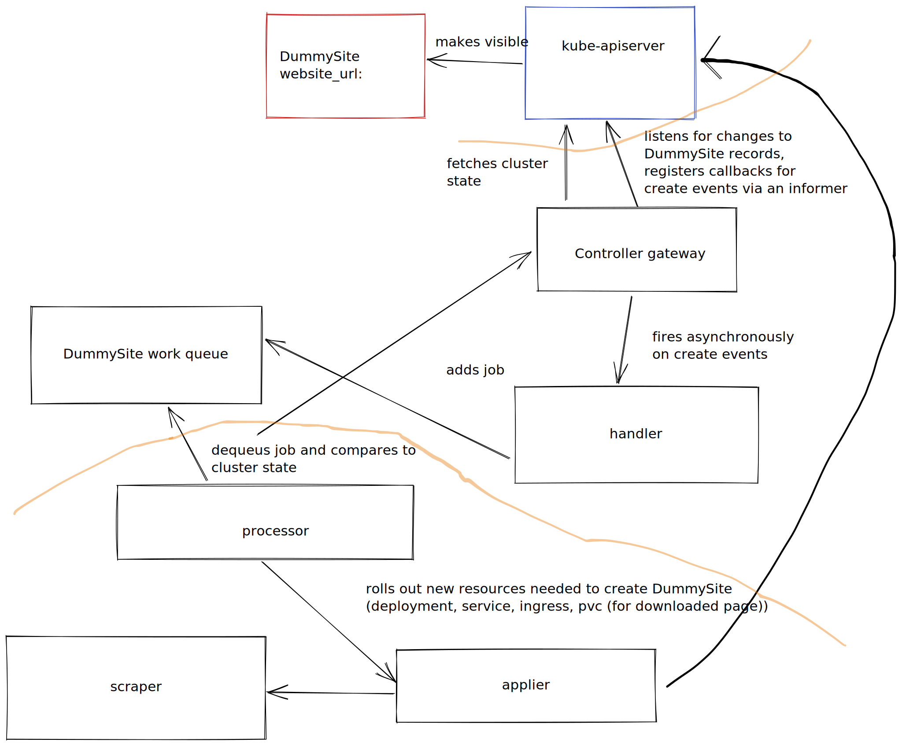

# DummySite Kubernetes Custom Resource controller

## About the application

Custom Kubernetes resource and controller for hosting static "DummySites" on a Kubernetes cluster. Given a URL, the controller will download that webpage and create the necessary resources on the cluster to access the downloaded webpage.

At the time of writing only a single html webpage is downloaded, meaning that when viewing the styles, scripts and images will likely be missing.

## Usage

The steps assume you have access to a Kubernetes cluster (can be a local one like [k3d](https://k3d.io/v5.4.4/) or [kind](https://kind.sigs.k8s.io/)) and have [kubectl](https://kubernetes.io/docs/tasks/tools/#kubectl) installed.

**Note**: At the time of writing, you must execute these commands in the default namespace.

1. Apply all the manifests in the `manifests` directory needed to add the CustomResourceDefinition and controller to the Kubernetes cluster
  ```bash
  $ kubectl apply -f manifests
  clusterrole.rbac.authorization.k8s.io/dummy-site-controller created
  clusterrolebinding.rbac.authorization.k8s.io/dummy-site-rolebinding created
  deployment.apps/dummy-site-controller created
  customresourcedefinition.apiextensions.k8s.io/dummysites.beta.dwk created
  serviceaccount/dummy-site-controller created
  ```

2. Create a DummySite resource, following the examples in the `examples` directory. Apply it to the Kubernetes cluster (e.g. with `kubectl apply -f`)
  ```yaml
  apiVersion: beta.dwk/v1
  kind: DummySite
  metadata:
    name: devopswithkubernetes
  spec:
    website_url: https://devopswithkubernetes.com/
  ```
  (example DummySite resource)
  ```bash
  $ kubectl apply -f examples/devopswithkubernetes.yml
  dummysite.beta.dwk/devopswithkubernetes created
  ```

3. Watch a DummySite, Deployment, Service and Ingress get created.
  ```bash
  $ kubectl get dummysites,deployments,services,ingresses
  NAME                                      URL
  dummysite.beta.dwk/devopswithkubernetes   https://devopswithkubernetes.com/

  NAME                                    READY   UP-TO-DATE   AVAILABLE   AGE
  deployment.apps/dummy-site-controller   1/1     1            1           26s
  deployment.apps/devopswithkubernetes    1/1     1            1           9s

  NAME                                   TYPE        CLUSTER-IP    EXTERNAL-IP   PORT(S)   AGE
  service/devopswithkubernetes-service   ClusterIP   10.43.64.76   <none>        80/TCP    9s

  NAME                                                     CLASS    HOSTS   ADDRESS      PORTS   AGE
  ingress.networking.k8s.io/devopswithkubernetes-ingress   <none>   *       172.20.0.3   80      9s
  ```

4. Navigate to where your ingress is exposed on with the path being the name of the DummySite resource, e.g. for the example above (assuming the loadbalancer is exposed on localhost:8080): http://localhost:8080/devopswithkubernetes

## Architecture

### Iteration 1



### Iteration 2


